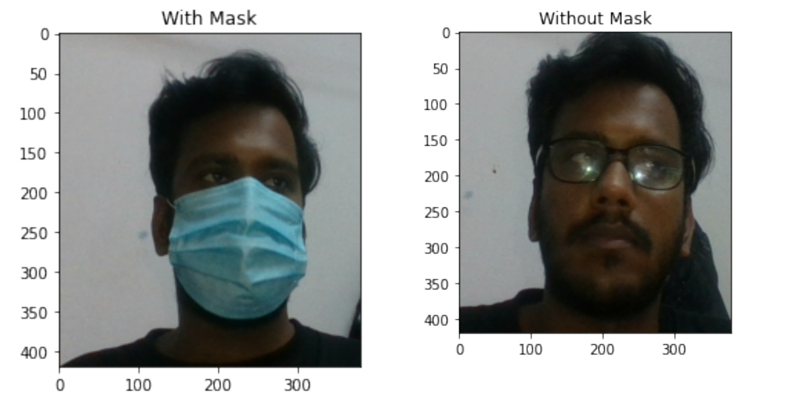

# Face-Mask-Detection-CNN-VGG16-Transfer-Learning

<div id="top"></div>
<!--
*** Thanks for checking out the Best-README-Template. If you have a suggestion
*** that would make this better, please fork the repo and create a pull request
*** or simply open an issue with the tag "enhancement".
*** Don't forget to give the project a star!
*** Thanks again! Now go create something AMAZING! :D
-->


<!-- PROJECT SHIELDS -->
<!--
*** I'm using markdown "reference style" links for readability.
*** Reference links are enclosed in brackets [ ] instead of parentheses ( ).
*** See the bottom of this document for the declaration of the reference variables
*** for contributors-url, forks-url, etc. This is an optional, concise syntax you may use.
*** https://www.markdownguide.org/basic-syntax/#reference-style-links
-->


<!-- PROJECT LOGO -->
<br />
<div align="center">
  <a href="https://github.com/roshan1208/Face-Mask-Detection--CNN-VGG16-Transfer-Learning-">
    
  </a>

<h3 align="center">Face Mask Detection</h3>

  <p align="center">
    Face mask recognition has been growing rapidly after corona insistent last years for
its multiple uses in the areas of Law Enforcement Security purposes and other commercial uses
    <br />

  </p>
</div>


### Create Conda Environment
* Create Conda Virtual Environment for better experience
  ```sh
  conda create --name tf
  ```
  Then
  ```sh
  conda activate tf
  ```
### Now Installation
* Tensorflow
  ```sh
  pip install tensorflow
  ```
* Numpy
  ```sh
  pip install numpy
  ```
* Matplotlib.pyplot
  ```sh
  pip install matplotlib.pyplot
  ```
* scikit-learn
  ```sh
  pip install scikit-learn
  ```
* cv2
  ```sh
  pip install cv2
  ```
* mediapipe
  ```sh
  pip install mediapipe
  ```

### Dowload dataset
Download dataset from following link
`https://indianinstituteofscience-my.sharepoint.com/:f:/g/personal/roshankumar_iisc_ac_in/EjzC-cZvH3hGuSyZqm1PABMBbDHkTUHRvmwfEN7d5tD0_g?e=AxwAfK`

### How to used
## 1. Train on simple Convolution Network
 Clone the repo
   ```sh
   git clone https://github.com/roshan1208/Face-Mask-Detection--CNN-with-Transfer-Learning-.git
   ```
   ## or
 Open `FaceMaskDetection.ipynb` and Follow along as discuss in that file  
## Used in Live stream-----
1. If you want to detect face mask in live stream through Laptop camera then 
2. Download my trained model `FaceMaskDetection.h5` from this link
`https://indianinstituteofscience-my.sharepoint.com/:u:/g/personal/roshankumar_iisc_ac_in/EeQO6Xjuz3ZNq284ocowi2UBv_2wGfVoOJKZ73mTqJDj5g?e=T3AW9z`
 and put it same folder as `Final.py` and `mediapipe_faceDetectionModule.py`.
3. Run `Final.py`  

## 2. Train on InceptionV3 through Transfer Learning
Open `FaceMaskDetection_With_InceptionV3.ipynb` and Follow along as discuss in that file  

## 3. Train on ResNet18 through Transfer Learning
Open `resnet18_pytorch_transfer Learning.ipynb` and Follow along as discuss in that file  

<p align="right">(<a href="#top">back to top</a>)</p>

<!-- CONTACT -->
## Contact

Your Name - Roshan Kumar Yadav - ros.roshan1208@gmail.com
            M.Tech - AI, IISc Bengaluru, India

<p align="right">(<a href="#top">back to top</a>)</p>
